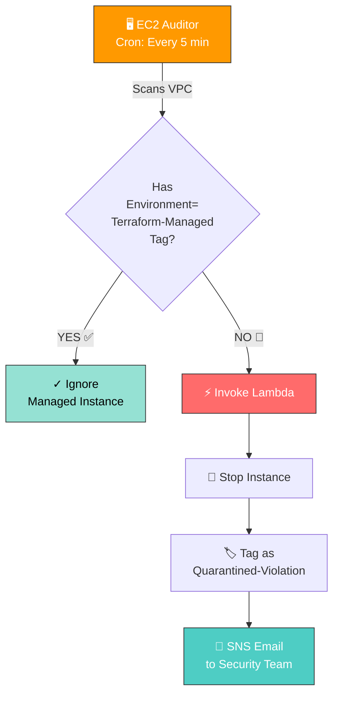

# ️ Drift Detective

<div align="center">


**Automated Cloud Security Enforcement System**

*Detect • Stop • Alert Rogue EC2 Instances in < 30 Seconds*

[Features](#-features) • [Architecture](#-architecture) • [Deploy](#-deployment) • [Demo](#-demo)

</div>

---

## 🎯 The Problem

> 💥 **Every minute counts:** Developers can spin up unauthorized EC2 instances in seconds, creating security blind spots that cost companies millions in compliance violations and unexpected charges.

**Traditional approach:** Manual audits every week/month  
**Drift Detective:** Automated enforcement every 5 minutes ⚡

---

## ✨ Features

| Feature | Description | Impact |
|---------|-------------|--------|
| 🔍 **Auto-Detection** | Scans VPC every 5 minutes for unauthorized instances | Zero manual effort |
| 🛑 **Instant Enforcement** | Stops rogue instances automatically | < 10 seconds response |
| 🏷️ **Audit Trail** | Tags violations for compliance tracking | Full accountability |
| 📧 **Real-Time Alerts** | SNS email notifications to security team | Immediate awareness |
| 🏗️ **IaC** | 23 AWS resources managed via Terraform | Reproducible & versioned |
| 💰 **Zero Cost** | 100% AWS Free Tier compliant | No budget impact |

---

## 🏗️ Architecture



### 🛠️ Tech Stack

| Component | AWS Service | Purpose |
|-----------|-------------|---------|
| **Auditor** | EC2 + Cron | Scans VPC every 5 min |
| **Enforcer** | Lambda | Stops & tags rogue instances |
| **Alerts** | SNS | Email notifications |
| **Storage** | RDS PostgreSQL | Audit logs |
| **Network** | VPC | Isolated environment |
| **Security** | IAM | Least privilege access |

 
### 🛠️ Tech Stack

- **Infrastructure:** Terraform (Infrastructure as Code)
- **Compute:** EC2 (Auditor), Lambda (Enforcer)
- **Database:** RDS PostgreSQL (Audit logs)
- **Networking:** VPC, Subnets, Security Groups
- **Messaging:** SNS (Email notifications)
- **Monitoring:** CloudWatch Logs
- **Security:** IAM Roles (Least privilege)

---

## 📊 Results

<div align="center">

| Metric | Value |
|--------|-------|
| ⚡ Detection Speed | < 5 minutes |
| 🎯 Enforcement Time | < 10 seconds |
| 📧 Alert Delivery | < 30 seconds |
| 💰 Monthly Cost | ₹0 (Free Tier) |
| 📦 Resources Managed | 23 AWS resources |
| 🔒 Security Posture | 100% automated |

</div>

---

## 🚀 Deployment

### Prerequisites
```bash
- AWS CLI configured
- Terraform >= 1.0
- AWS Free Tier account

# Clone the repository
git clone https://github.com/YOUR_USERNAME/drift-detective.git
cd drift-detective

# Initialize Terraform
terraform init

# Deploy all 23 resources
terraform apply

# Type 'yes' when prompted
# Wait 5-10 minutes for deployment

terraform destroy

📸 Demo:

BEFORE ENFORCEMENT:

Instance: i-0abc123
State: Running
Tags: None
Status: ⚠️ ROGUE

AFTER ENFORCEMENT:

Instance: i-0abc123
State: Stopped
Tags: 
  - Status: Quarantined-Violation
  - QuarantinedBy: DriftDetective-Lambda
Status: ✅ ENFORCED

Subject: 🚨 Rogue Instance Quarantined: i-0abc123

🚨 SECURITY ALERT: Rogue EC2 Instance Detected

Instance ID: i-0abc123
Action Taken: Instance stopped and tagged
Status: Quarantined-Violation

This instance was detected without the required 
'Environment=Terraform-Managed' tag.
